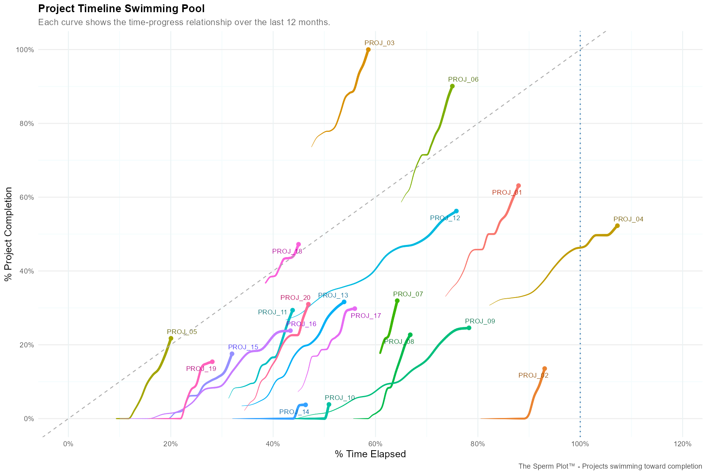

# The Sperm Plot™ 🧬📊

> **Patent Pending:** A novel visualization technique for project timeline analysis

[](https://opensource.org/licenses/MIT)
[](https://www.r-project.org/)
[](https://github.com/gd047/sperm-plot-visualization)

## What is the Sperm Plot™?

Each trajectory represents a project **swimming upstream** toward completion. Like biological swimmers racing toward their destination, some projects race ahead while others struggle to keep pace.



## 🏊‍♂️ Trajectory Patterns

- **🏆 Above diagonal:** Projects ahead of schedule - "Fast swimmers"
- **✅ On diagonal:** Projects on track - Ideal progression  
- **⚠️ Below diagonal:** Projects behind schedule - "Struggling swimmers"
- **🚫 On X-axis:** Stalled projects - Haven't started or are blocked
- **🔴 Beyond 100% time:** Overdue projects

## 🚀 Quick Start

### 1. Generate Sample Data
```r
source("synthetic_data_generator.R")
# Creates sample_project_data.csv with realistic project timelines
```

### 2. Create Interactive Visualization
```r
source("plotly_sperm_plot_demo.R")
# Interactive plot with custom hover positioning
```

### 3. Create Static Publication Version
```r
source("ggplot_sperm_plot_demo.R")
# High-resolution plot for reports and publications
```

## 📊 Your Data Requirements

The Sperm Plot works with **minimal data requirements**:

| Column | Description | Example |
|--------|-------------|---------|
| `symv_no` | Project identifier | "PROJ_01" |
| `months_ago` | Time reference (0 = current) | 0, 1, 2, ..., 12 |
| `snapshot_date` | Observation date | "2025-07-26" |
| `start_date` | Project start date | "2024-01-15" |
| `end_date` | Project planned end | "2026-12-31" |
| `cur_symvat` | Total budget (EUR) | 5000000 |
| `sum_work` | Work completed (EUR) | 2250000 |

**That's it!** All percentage calculations are derived automatically.

## 🎯 Key Features

### Interactive Version (Plotly)
- ✅ **Custom hover positioning** - Solves the tooltip obstruction problem
- ✅ **Click-to-hide legend** - Interactive project filtering
- ✅ **Responsive design** - Works on desktop and tablets
- ✅ **Export options** - Save as HTML or PNG

### Static Version (ggplot2)
- ✅ **Smooth trajectory interpolation** - Publication-ready curves
- ✅ **Variable line thickness** - Shows temporal progression
- ✅ **Anti-collision labels** - Clean, readable project names
- ✅ **High-resolution export** - Perfect for presentations

## 🔧 Installation

```r
# Required packages
install.packages(c("dplyr", "plotly", "htmlwidgets", 
                   "tidyverse", "scales", "ggrepel"))
```

## 📈 Real-World Applications

- **Project Portfolio Management** - Track multiple projects simultaneously
- **Executive Dashboards** - Visual KPIs for leadership teams  
- **Risk Assessment** - Identify struggling projects early
- **Resource Planning** - Understand project velocity patterns
- **Client Reporting** - Professional visualizations for stakeholders

## 🏊‍♂️ Why "Sperm Plot"?

The trajectories genuinely resemble biological swimmers:
- **Head (current position):** Where the project is now
- **Tail (historical data):** The path taken to get there
- **Swimming motion:** Progress toward completion
- **Pool (plot area):** The project timeline environment

It's both scientifically accurate and memorably descriptive!

## 🤝 Contributing

Found a bug? Have an improvement idea? 

1. Fork the repository
2. Create your feature branch (`git checkout -b feature/amazing-feature`)
3. Commit your changes (`git commit -m 'Add amazing feature'`)
4. Push to the branch (`git push origin feature/amazing-feature`)
5. Open a Pull Request

## 📄 License

This project is licensed under the MIT License - see the [LICENSE](LICENSE) file for details.

## 🙏 Acknowledgments

- Inspired by real-world project management challenges
- Built with the amazing R visualization ecosystem
- Special thanks to the tidyverse and plotly communities
- **Developed with crucial assistance from AI models:**
  - **Claude Sonnet 4** - Advanced reasoning, code optimization, and technical problem-solving
  - **ChatGPT o4-mini (Advanced Data Analysis)** - Data processing and analytical insights

## 🔍 Related Keywords

sperm plot, R data visualization, trajectory plot in R, ggplot2, plotly, tidyverse graphics, project management

*This project showcases the power of human-AI collaboration in data visualization innovation.*

---

**Made with ❤️ and lots of ☕**

*If this helped your project management, consider giving it a ⭐!*

---

> *"In the swimming pool of project management, not all swimmers finish the race at the same time."*
